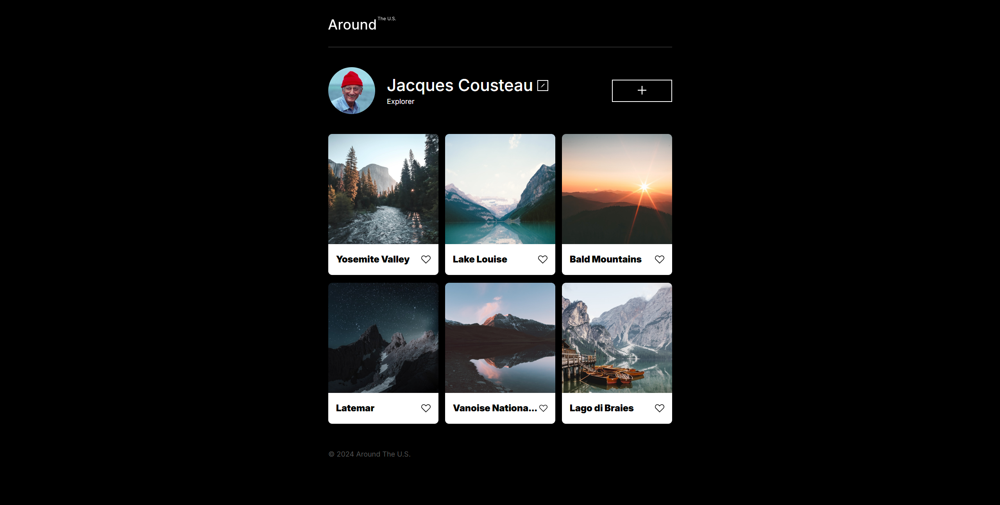
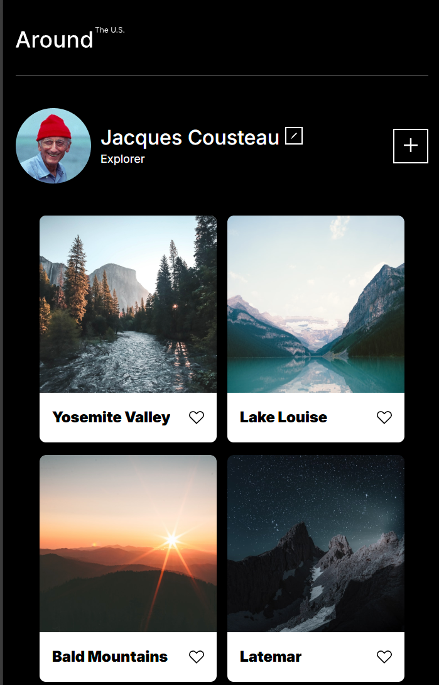
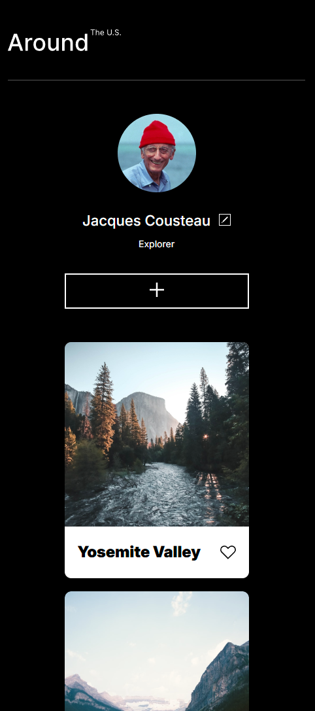

# Project 3: Around the U.S.

This is a simple webpage showcasing landscapes and scenic locations across the United States. The page features a gallery of images from various famous destinations, including Yosemite Valley, Lake Louise, and more, along with a profile section highlighting Jacques Cousteau as an explorer.

## Features:

- **Profile Section**: Displays the profile of Jacques Cousteau, an iconic explorer.
- **Gallery Section**: A collection of images representing stunning natural landscapes.
- **Responsive Design**: The page is designed to be mobile-friendly and adjusts to different screen sizes.

## Technologies Used:

- HTML5
- CSS3
- Grid & Flexbox
- Responsive Design using Media Queries

## How to View:

To view it live on the web, you may click here: [GitHub Pages](https://lidor-cohen.github.io/se_project_aroundtheus/)

## Media:

